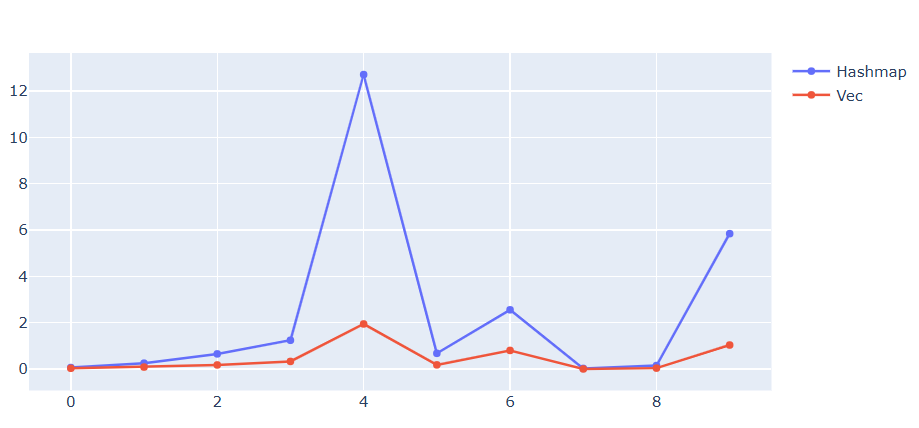
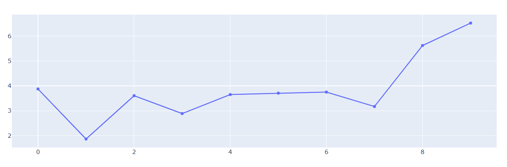
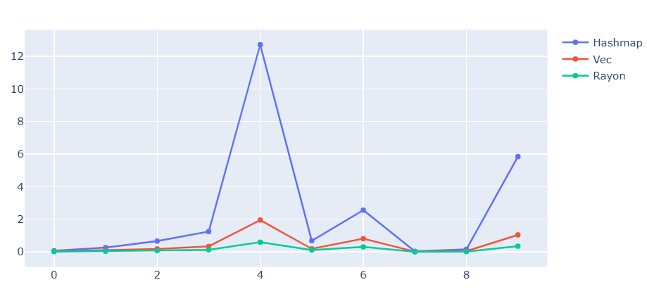

# Cellular Automatons on Rust

High-performance Conway's Game of Life implementation in Rust** with CLI, WebP animation export

[](.github/animation.webp)

## Benchmark

Tests name format:
`test{order_id}_{steps}_{Width}x{Height}`.

```js
running 10 tests
test automaton::tests::test11_100 ... 100 200 100 100
Test 0: 0.037s (0.200s): OK
test automaton::tests::test12_100_200x200 ... 100 400 200 200
Test 0: 0.089s (0.400s): OK
test automaton::tests::test13_100_300x300 ... 100 1500 300 300
Test 0: 0.180s (1.500s): OK
test automaton::tests::test14_100_400x400 ... 100 2000 400 400
Test 0: 0.332s (2.000s): OK
test automaton::tests::test15_100_1000x1000 ... 100 20000 1000 1000
Test 0: 1.949s (20.000s): OK
test automaton::tests::test21_1000 ... 1000 1500 100 100
Test 0: 0.184s (1.500s): OK
test automaton::tests::test22_1000_200x200 ... 1000 3500 200 200
Test 0: 0.807s (3.500s): OK
test automaton::tests::test31_50_100x100 ... 50 100 100 100
Test 0: 0.008s (0.100s): OK
test automaton::tests::test32_50_200x200 ... 50 300 200 200
Test 0: 0.043s (0.300s): OK
test automaton::tests::test33_50_1000x1000 ... 50 15000 1000 1000
Test 0: 1.040s (15.000s): OK
```


### Vec vs HashMap

#### Vec\<Vec\<i32\>\> result
```js
running 10 tests
test automaton::tests::test11_100 ... 100 200 100 100
Test 0: 0.037s (0.200s): OK
test automaton::tests::test12_100_200x200 ... 100 400 200 200
Test 0: 0.089s (0.400s): OK
test automaton::tests::test13_100_300x300 ... 100 1500 300 300
Test 0: 0.180s (1.500s): OK
test automaton::tests::test14_100_400x400 ... 100 2000 400 400
Test 0: 0.332s (2.000s): OK
test automaton::tests::test15_100_1000x1000 ... 100 20000 1000 1000
Test 0: 1.949s (20.000s): OK
test automaton::tests::test21_1000 ... 1000 1500 100 100
Test 0: 0.184s (1.500s): OK
test automaton::tests::test22_1000_200x200 ... 1000 3500 200 200
Test 0: 0.807s (3.500s): OK
test automaton::tests::test31_50_100x100 ... 50 100 100 100
Test 0: 0.008s (0.100s): OK
test automaton::tests::test32_50_200x200 ... 50 300 200 200
Test 0: 0.043s (0.300s): OK
test automaton::tests::test33_50_1000x1000 ... 50 15000 1000 1000
Test 0: 1.040s (15.000s): OK
```


#### HashMap<(u32, u32), i32> result
```js
running 10 tests
test automaton::tests::test11_100 ... 100 200 100 100
Test 0: 0.069s (0.200s): OK
test automaton::tests::test12_100_200x200 ... 100 400 200 200
Test 0: 0.257s (0.400s): OK
test automaton::tests::test13_100_300x300 ... 100 1500 300 300
Test 0: 0.657s (1.500s): OK
test automaton::tests::test14_100_400x400 ... 100 2000 400 400
Test 0: 1.245s (2.000s): OK
test automaton::tests::test15_100_1000x1000 ... 100 20000 1000 1000
Test 0: 12.712s (20.000s): OK
test automaton::tests::test21_1000 ... 1000 1500 100 100
Test 0: 0.682s (1.500s): OK
test automaton::tests::test22_1000_200x200 ... 1000 3500 200 200
Test 0: 2.559s (3.500s): OK
test automaton::tests::test31_50_100x100 ... 50 100 100 100
Test 0: 0.031s (0.100s): OK
test automaton::tests::test32_50_200x200 ... 50 300 200 200
Test 0: 0.155s (0.300s): OK
test automaton::tests::test33_50_1000x1000 ... 50 15000 1000 1000
Test 0: 5.846s (15.000s): OK
```

#### Conclusion

AS EXPECTED: Linear 2D Vec matrix is faster than hashmap with all it's tuples, unwraps and hashing.



Plot of Hashmap implementation time divided by Vec implementation time. (Pairs sorted by hashmap time, see [notebook](.github/benches.ipynb))


## Vec vs Rayon threading Vec


```js
running 10 tests
test automaton::tests::test11_100 ... 100 200 100 100
Test 0: 0.012s (0.200s): OK
test automaton::tests::test12_100_200x200 ... 100 400 200 200
Test 0: 0.038s (0.400s): OK
test automaton::tests::test13_100_300x300 ... 100 1500 300 300
Test 0: 0.075s (1.500s): OK
test automaton::tests::test14_100_400x400 ... 100 2000 400 400
Test 0: 0.125s (2.000s): OK
test automaton::tests::test15_100_1000x1000 ... 100 20000 1000 1000
Test 0: 0.593s (20.000s): OK
test automaton::tests::test21_1000 ... 1000 1500 100 100
Test 0: 0.112s (1.500s): OK
test automaton::tests::test22_1000_200x200 ... 1000 3500 200 200
Test 0: 0.303s (3.500s): OK
test automaton::tests::test31_50_100x100 ... 50 100 100 100
Test 0: 0.005s (0.100s): OK
test automaton::tests::test32_50_200x200 ... 50 300 200 200
Test 0: 0.016s (0.300s): OK
test automaton::tests::test33_50_1000x1000 ... 50 15000 1000 1000
Test 0: 0.346s (15.000s): OK
```
